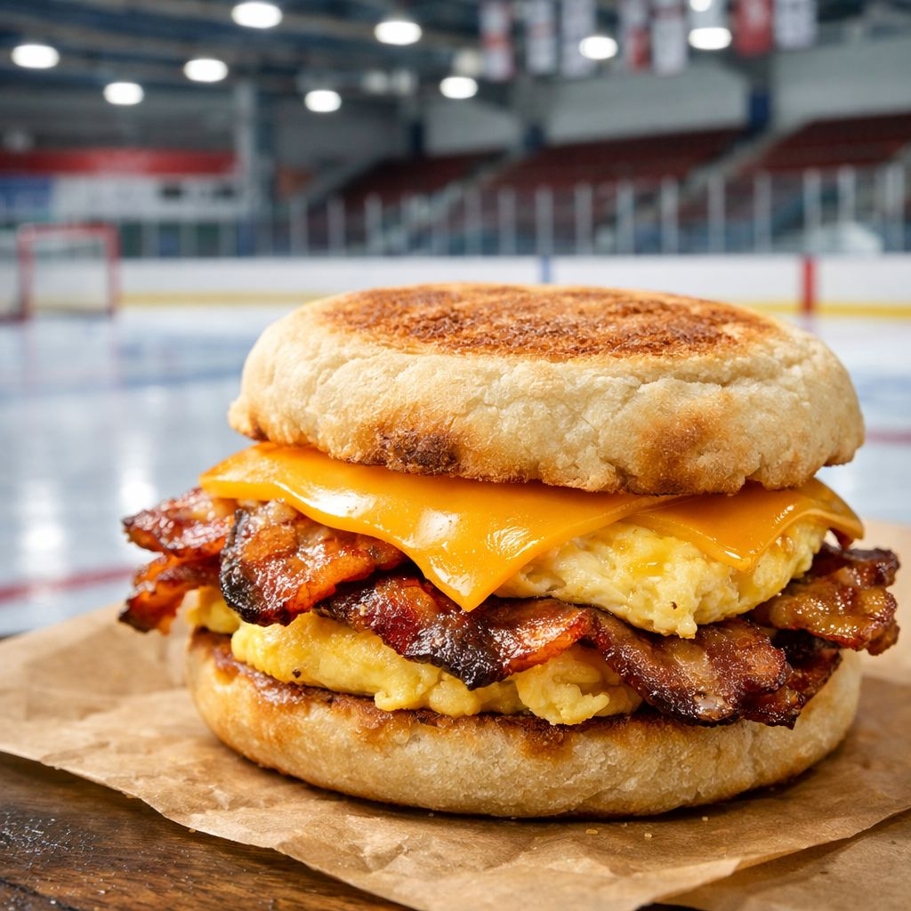

# Gourmet on the Go 🍔

> **Premium Street Food Website** - A high-fidelity, responsive single-page website for a gourmet food truck.

## 📌 Overview
Gourmet on the Go is a modern, visually striking website designed for a high-end food truck. It features a "dark mode" aesthetic with vibrant graffiti-style accents, reflecting the urban energy of street food culture while maintaining a premium feel.

## ✨ Features
- **Dynamic Hero Section:** Floating animations and parallax-style background.
- **Interactive Menu:** JavaScript-powered category filtering (Burgers, Fries, Sides) without page reloads.
- **Brand Story:** Visual storytelling section with stacked image layouts.
- **Location Tracker:** "Where are we today?" section (ready for Maps API integration).
- **Responsive Design:** Fully optimized for mobile, tablet, and desktop.
- **Social Integration:** Instagram feed grid and newsletter capture.

## 🛠️ Tech Stack
- **HTML5:** Semantic structure.
- **Tailwind CSS:** Utility-first styling for rapid, responsive design.
- **JavaScript (Vanilla):** Light logic for menu filtering and interactions.
- **FontAwesome:** Icons for social media and UI elements.

## 🚀 Getting Started
1. Clone the repository.
2. Open `index.html` in your browser.
3. No build steps required! (Just a static site).

## 🎨 Asset Credits
- **Unsplash:** High-quality food photography.
- **Google Fonts:** Anton, Permanent Marker, Urbanist.
- **Transparent Textures:** Background patterns.

---

*Desgined & Developed for Gourmet on the Go.*
